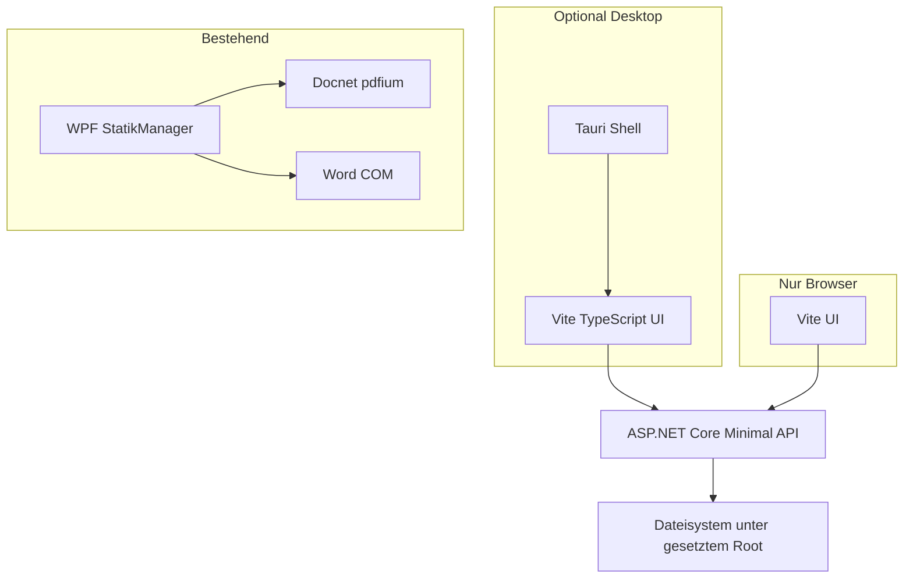

# StatikManager: Web-UI („HTML“) – Scope, Lücken, Architektur

Dieses Dokument setzt die strategische Klärung aus dem Plan **„StatikManager komplett in HTML – sinnvoll oder nicht?“** in konkrete Entscheidungshilfen, eine Feature-Matrix und eine Architektur-/Migrationsrichtung um.  
Verwandt: [ARCHITEKTUR.md](ARCHITEKTUR.md) (WPF), [statikmanager-web/README.md](../statikmanager-web/README.md), [statikmanager-web/TAURI-DESKTOP.md](../statikmanager-web/TAURI-DESKTOP.md).

---

## 1. Scope-Klärung (Ersetzen vs. ergänzen; Parität)

### 1.1 Was „komplett in HTML“ praktisch heißt

| Interpretation | Machbarkeit |
|----------------|-------------|
| **Nur** statische Seite / SPA im Browser **ohne** lokales Backend | **Unzureichend** für StatikManager: kein kontrollierter Zugriff auf Projektordner, kein Word-COM, kein pdfium-Schnitteditor. |
| **Web-UI** (HTML/CSS/TypeScript) **+** lokale **ASP.NET Core API** (Dateien, Streams) | **Sinnvoll** – entspricht [statikmanager-web](../statikmanager-web/README.md). |
| Zusätzlich **Desktop-Hülle** (z. B. **Tauri**) für nativen Ordnerdialog und festes Fenster | **Sinnvoll** – siehe [TAURI-DESKTOP.md](../statikmanager-web/TAURI-DESKTOP.md). |

**Empfehlung:** „HTML“ als **Präsentations- und Interaktionsschicht** verstehen, nicht als Ersatz für Betriebssystem-, Office- und PDF-Native-Funktionen ohne begleitende Runtime.

### 1.2 Produktentscheidung: drei Szenarien

| Szenario | Beschreibung | Wann sinnvoll |
|----------|--------------|----------------|
| **A – Koexistenz** | WPF bleibt Hauptprodukt für Bearbeitung/Office/PDF-Schnitt; Web nur Lesen/Browsen/Vorschau oder Portabilität. | Schneller Nutzen, geringes Risiko; Team will Web nicht komplett neu bauen. |
| **B – schrittweise Parität** | Web-UI wächst; schwere Features werden als **Dienste** (API, ggf. Hilfsprozess) nachgezogen; WPF wird später reduziert. | Klare Roadmap und Budget für PDF/Word-Neuentwicklung oder gekapselte Native-Prozesse. |
| **C – vollständiger Ersatz** | WPF wird abgeschaltet; alle Funktionen in Web+Backend (+ ggf. Tauri). | Nur wenn **explizit** PDF-Schnitteditor-, Word- und Einstellungs-Parität akzeptiert und finanziert sind (sehr hoher Aufwand). |

### 1.3 Parität: PDF-Schnitteditor und Word

| Bereich | In WPF | Für „Web ersetzt WPF“ nötig |
|---------|--------|------------------------------|
| **PdfSchnittEditor** (Docnet/pdfium, `_bearbeitet.pdf`, JSON-Metadaten, UI) | Voll integriert | Neuimplementierung im Browser (z. B. PDF.js + Canvas) **oder** gekapselter **Native-/Desktop-Hilfsprozess** mit API; beides ist ein eigenes Projekt. |
| **Word** (Interop, Vorschau, Export-Pipelines) | COM auf STA-Thread | Kein direkter Browser-Zugriff; **Server-/Sidecar-Automatisierung**, oder **nur** Anzeige über konvertierte PDFs/Bilder, oder Feature-Verzicht im Web. |

**Festlegung für das Repo (bis zur nächsten expliziten Änderung):** Standardannahme **Szenario A (Koexistenz)**; Szenario B/C nur nach **expliziter** Stakeholder-Entscheidung und gesonderter Planung.

---

## 2. Feature-Matrix: WPF vs. statikmanager-web

### 2.1 WPF-Module (Quelle: [MainWindow.xaml.cs](../src/StatikManager/MainWindow.xaml.cs), [ARCHITEKTUR.md](ARCHITEKTUR.md))

| Bereich / Feature | WPF (Stand Repo) | statikmanager-web |
|-------------------|------------------|-------------------|
| Projekt root setzen (Pfad) | Ja (Dialog, Combo, Einstellungen) | Ja (`POST /api/session/root`, manuell oder Tauri-Ordnerdialog) |
| Gespeicherte Projektliste | `Einstellungen.xml` / UI | Ja (`GET/POST/DELETE /api/projects`, [ProjectListStore](../statikmanager-web/src/StatikManager.Api/Services/ProjectListStore.cs)) |
| Ordnerbaum / Navigation | Ja (inkl. Filter, Baum/Liste) | Ja (Browse-UI, `GET /api/browse`) |
| Datei-Metadaten | Im Panel | Ja (`GET /api/file/meta`) |
| Vorschau PDF | PdfSchnittEditor (pdfium) | iframe + Browser-PDF (`GET /api/preview/stream`) |
| Vorschau Bild | WebBrowser / Controls | `` |
| Vorschau HTML | WebBrowser + Toolbar | iframe + sandbox `allow-same-origin` |
| Vorschau JSON/Text | Formatiert | fetch + `<pre>` / formatiertes JSON |
| **PDF bearbeiten** (Schnitt, Speichern, `_bearbeitet.pdf`) | Ja | **Nein** |
| **Word** öffnen/erzeugen/Export (COM) | WordExportModul, Vorschau | **Nein** |
| **Bildschnitt**-Werkzeug (eigenes Modul) | BildschnittModul | **Nein** |
| FileSystemWatcher (Struktur/Datei live) | Ja | **Nein** (kann später per Polling/WebSocket ergänzt werden) |
| PP_ZoomRahmen `position.html` / `position.json` | Ja (Routing, Kontext) | Teilweise (Anzeige möglich, kein dediziertes PP-Feature-Set) |
| Einstellungen (Word-Vorlagen, Ansicht, …) | WPF-Einstellungenfenster | **Nein** / nur was API+Web bereits abbildet |

Legende für letzte Spalte: **Ja** = vorhanden oder vergleichbar; **Nein** = nicht implementiert bzw. fundamental anderer Stack.

### 2.2 API-Endpunkte (Kurzüberblick)

Siehe [statikmanager-web/README.md](../statikmanager-web/README.md): `health`, `session/root`, `browse`, `file/meta`, `preview/stream`, `projects`.

---

## 3. Architektur und Migrationsrichtung

### 3.1 Zielbild (empfohlen für Koexistenz + optionales Wachstum)

- **Web-UI** spricht nur mit der **API** (gleiche Origin bei `wwwroot`-Build oder Proxy in Dev).
- **Tauri** löst Ordnerdialog und „Desktop-Fühlen“, nicht die PDF/Word-Logik.
- **WPF** bleibt für Funktionen, die heute **nicht** in der API stecken.

### 3.2 Geteilte .NET-Bibliothek (optional, mittelfristig)

| Ziel | Beispiel-Inhalt | Nutzen |
|------|------------------|--------|
| Eine kleine **Class Library** (z. B. `netstandard2.0` oder `net8.0`), referenziert von WPF und API | `DateiTypen` / Routing-Regeln, gemeinsame Konstanten, Validierung von relativen Pfaden | Weniger Duplikat zwischen [DocumentRoutingService](../src/StatikManager/Infrastructure/DocumentRoutingService.cs) und [FileKind](../statikmanager-web/src/StatikManager.Api/Contracts/File/FileKind.cs) |

**Hinweis:** WPF ist **net48**, API ist **net8** – gemeinsame Bibliothek braucht abgestimmtes **TFM** (z. B. doppelte Targeting oder Logik nur in API und WPF ruft nicht zu – dann „geteilt“ nur konzeptionell über Spezifikation/Tests).

### 3.3 Phasenplan (Orientierung, keine Terminbindung)

| Phase | Inhalt | Erfolgskriterium |
|-------|--------|------------------|
| **0** | Scope dokumentiert (dieses Dokument); Standard **Koexistenz** | Team kennt Lückenmatrix |
| **1** | Web weiter ausbauen: Watch/Reload, bessere HTML-Vorschau, Fehlerfälle | Keine Regression in API-Sicherheit (Pfad nur unter Root) |
| **2** | Optional: gemeinsame Regeln/Bibliothek oder Contract-Tests WPF↔API | Gleiche Dateityp-Zuordnung für Kernfälle |
| **3** | Nur bei Bedarf: PDF-Bearbeitung als **eigenes** Projekt (Browser oder Sidecar) | Definierte Mindest-Features vs. WPF |
| **4** | Nur bei Bedarf: Word-Pipeline ausgelagert | Lizenz-, Deployment- und Fehlerkonzept |

---

## 4. Fazit

- **„Komplett in HTML“** ist **sinnvoll** als **Web-Oberfläche** mit **lokaler API** und optional **Tauri** – nicht als reines HTML ohne Backend.
- **Vollständiger WPF-Ersatz** mit gleicher PDF-/Word-Tiefe ist ein **großes** Vorhaben und sollte nur unter Szenario **B/C** geplant werden.
- **Empfohlene Default-Strategie:** **Koexistenz** ([Abschnitt 1.2](#12-produktentscheidung-drei-szenarien)), Web für Navigation und Vorschau ausbauen, WPF für Bearbeitung und Office-Integration beibehalten, bis eine bewusste Paritätsentscheidung fällt.

---

## 5. Nächste Schritte (operativ)

1. Stakeholder: Szenario **A**, **B** oder **C** aus [1.2](#12-produktentscheidung-drei-szenarien) festhalten.  
2. Bei **A**: `statikmanager-web` gezielt um Nutzerfeedback erweitern (ohne PdfSchnittEditor zu kopieren).  
3. Bei **B/C**: separates technisches Pflichtenheft für PDF und Word mit Aufwandsschätzung.  
4. Dieses Dokument bei Architekturentscheidungen aktualisieren (Datum im Commit).
